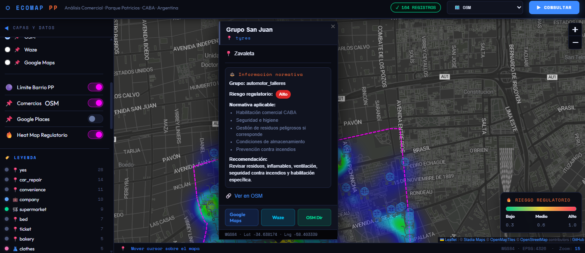

# 🗺️ EcoMap PP — Análisis Territorial Comercial · Regulatorio · Parque Patricios

> Mapa web interactivo de análisis territorial comercial y riesgo regulatorio en **Parque Patricios, CABA, Argentina**.  
> Desarrollado con **Leaflet.js** y datos abiertos de **OpenStreetMap** vía **Overpass API**.

[](https://denplus007.github.io/ecoomercemap-parque-patricios)
[](https://www.openstreetmap.org)
[](https://leafletjs.com)
[](LICENSE)

---

## 📸 Preview



---

## 🎥 Demo

https://github.com/DenPlus007/ecoomercemap-parque-patricios/blob/main/demo.mp4

---

## ✨ Características

| Funcionalidad | Descripción |
|---|---|
| 🔴 **Consulta en tiempo real** | Conecta con Overpass API al hacer clic en el botón |
| 📌 **Marcadores personalizados** | Íconos por categoría OSM con colores diferenciados |
| 💬 **Tooltips con coordenadas** | Al hacer hover se muestra nombre, categoría y lat/lng WGS84 |
| 🪟 **Popups detallados** | Click en marcador → nombre, dirección, web, teléfono, horarios |
| 🎛️ **Sidebar colapsable** | Panel lateral izquierdo con estadísticas, leyenda y filtros |
| 🗂️ **Control de capas** | 5 mapas base: Voyager, Positron, ESRI Gray, Dark, OSM |
| 🔍 **Filtro en tiempo real** | Buscar por nombre, rubro o dirección |
| 💾 **Exportar datos** | Descarga el dataset en GeoJSON y CSV |
| 📐 **CRS WGS84** | Coordenadas en EPSG:4326 |

---

## 🛠️ Stack tecnológico

```
Leaflet.js 1.9.4      →  Motor de mapas interactivo
Overpass API          →  Consulta de datos OSM en tiempo real
CartoDB Tiles         →  Mapas base (Voyager / Positron / Dark)
ESRI World Gray       →  Mapa base alternativo
JavaScript ES6+       →  Lógica de la aplicación (Vanilla JS)
HTML5 / CSS3          →  Estructura y estilos
```

---

## 🚀 Uso rápido

### Opción A — Abrir directamente en el navegador

```bash
git clone https://github.com/DenPlus007/ecoomercemap-parque-patricios.git
cd ecomap-parque-patricios
# Abrir index.html en tu navegador
open index.html        # macOS
start index.html       # Windows
xdg-open index.html    # Linux
```

### Opción B — GitHub Pages (recomendado para compartir)

1. Ir a **Settings → Pages**
2. Source: `main` branch, carpeta `/ (root)`
3. Guardar → tu mapa queda en: `https://denplus007.github.io/ecoomercemap-parque-patricios`

---

## 🗂️ Estructura del repositorio

```
ecomap-parque-patricios/
├── index.html              # Aplicación completa (single-file)
├── README.md               # Este archivo
├── LICENSE                 # MIT
└── assets/
    └── screenshot.png      # Captura de pantalla para el README
```

> El proyecto es un **single-page application** de un solo archivo HTML.  
> No requiere instalación de dependencias ni servidor backend.

---

## 🗺️ Datos consultados (Overpass API)

La query busca los siguientes elementos OSM dentro del área de **Parque Patricios**:

| Tag OSM | Tipo |
|---|---|
| `shop=*` | Comercios en general |
| `office=*` | Oficinas y empresas |
| `amenity=marketplace` | Mercados |
| `craft=*` | Talleres y oficios |
| `shop=electronics` | Electrónica |
| `shop=supermarket` | Supermercados |
| `shop=clothes` | Indumentaria |
| `office=company` | Sedes corporativas |

**Campos exportados:**

```json
{
  "id":        "OSM node/way ID",
  "nombre":    "name tag",
  "categoria": "shop | office | amenity | craft",
  "rubro":     "subtipo de shop",
  "direccion": "addr:street + addr:housenumber",
  "telefono":  "phone",
  "website":   "website",
  "email":     "email",
  "horarios":  "opening_hours",
  "lat":       "latitud WGS84",
  "lon":       "longitud WGS84",
  "fuente":    "OpenStreetMap"
}
```

---

## 📍 Área de estudio

**Parque Patricios**, barrio de la Ciudad Autónoma de Buenos Aires (CABA), Argentina.  
Coordenadas de referencia: `[-34.63756234066582, -58.40596551597899]` · Zoom inicial: `13`

---

## 🔧 Personalización

### Cambiar el área de búsqueda

En `index.html`, modificar la línea del query Overpass:

```js
// Cambiar "Parque Patricios" por cualquier barrio o municipio
area["name"="Parque Patricios"]->.searchArea;

// Ejemplo: Palermo
area["name"="Palermo"]->.searchArea;
```

### Cambiar el punto de vista inicial

```js
map.setView([-34.XXXXX, -58.XXXXX], 13);
```

### Agregar categorías

```js
// Dentro del query Overpass, agregar líneas como:
node["amenity"="restaurant"](area.searchArea);
node["amenity"="bank"](area.searchArea);
```

---

## 📄 Licencia

[MIT](LICENSE) — Libre para usar, modificar y distribuir con atribución.

---

## 👩‍💻 Autora

Desarrollado por **Denise Hernández** — Geógrafa & Analista GIS  
[](https://linkedin.com/in/denise-hern%C3%A1ndez-a3071968)
[](https://github.com/DenPlus007)

---

*Datos © OpenStreetMap contributors — ODbL License*
### Importante

- La capa OSM funciona sin API Key.
- La capa Google Places requiere backend activo.
- No abras el `index.html` directo si querés usar Google Places; usá `http://localhost:3000`.
